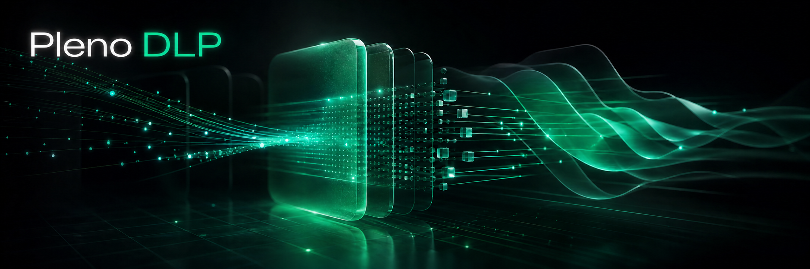

<p align="center">
  
</p>

<h1 align="center">Pleno DLP</h1>

<p align="center">
  Unified DLP scanner for secrets and PII across filesystem, git, stdin, and SaaS sources.
</p>

<p align="center">
  <a href="https://github.com/plenoai/pleno-dlp/actions/workflows/test.yml">
    
  </a>
  <a href="https://github.com/plenoai/pleno-dlp/releases">
    
  </a>
  <a href="https://github.com/plenoai/pleno-dlp/blob/main/LICENSE">
    
  </a>
  <a href="https://github.com/plenoai/pleno-dlp/blob/main/go.mod">
    
  </a>
</p>

```sh
go install github.com/plenoai/pleno-dlp/cmd/pleno-dlp@latest

pleno-dlp protect
pleno-dlp scan filesystem ./repo
pleno-dlp scan git --repo ./repo --max-depth 200
pleno-dlp scan filesystem ./repo --format sarif > findings.sarif
```

## Target source

- `filesystem`: working trees, build outputs, arbitrary directories
- `git`: local history with branch / depth / time filters
- `stdin`: diffs, exports, and pipe-based checks
- SaaS: GitHub, GitLab, Bitbucket, Slack, Notion, Confluence, Jira

```sh
pleno-dlp scan filesystem ./repo
pleno-dlp scan git --repo ./repo --branch main --max-depth 500
git diff | pleno-dlp scan stdin --label git-diff
pleno-dlp scan github --org acme
```

More connector detail: [`docs/source-forge-api-comments.md`](docs/source-forge-api-comments.md)

## Detect coverage

- 603 built-in detector types (registered in `pkg/detectors`; see
  [`docs/counts.md`](docs/counts.md) for what "detector type" counts)
- table / JSON / SARIF output
- custom allowlists and org-specific rules supported

```sh
pleno-dlp detectors list
pleno-dlp detectors list --format json
pleno-dlp scan filesystem ./repo --format sarif > findings.sarif
```

More output and CI detail: [`docs/output-and-gating.md`](docs/output-and-gating.md)

Measured comparison against trufflehog and gitleaks (synthetic and
real-world recall, noise, verification value, capability probes):
[`docs/comparison.md`](docs/comparison.md)

## Verification support

Provider-side validation runs by default where available.

```sh
pleno-dlp scan filesystem ./repo
pleno-dlp detectors list --verify-status
```

Coverage and unverified classes: [`docs/verify-coverage.md`](docs/verify-coverage.md)

## Revocation support

`pleno-dlp revoke` can invalidate supported leaked credentials for GitHub,
GitLab, Slack, AWS, and Stripe restricted keys.

```sh
echo "$LEAKED_TOKEN" | pleno-dlp revoke --detector github --secret - --confirm
pleno-dlp revoke --detector slack --secret xoxb-... --dry-run
pleno-dlp detectors list --revoke-support
```

Details and safety constraints: [`docs/revoke-support.md`](docs/revoke-support.md)

## PII detection

PII scanning is opt-in.

```sh
pleno-dlp scan filesystem ./src --pii-engine=anonymize
```

Advanced flags and engine setup:

- `pleno-dlp scan --help`
- `pleno-dlp pii-server --help`
- [`docs/pii-detection.md`](docs/pii-detection.md)

## License

[AGPL-3.0](LICENSE).
