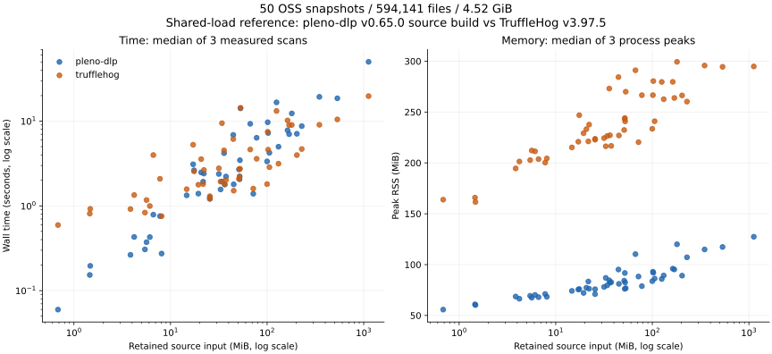
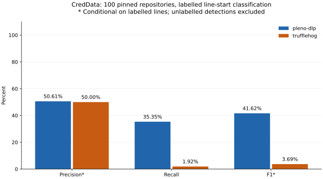

# pleno-dlp / TruffleHog 大規模OSS比較レポート

**実行時間・CPU・メモリは、他の開発作業が同時に動いたMacでの参考値である。専有環境での速度順位や倍率を示すものではない。**

計測日（UTC）: 2026-09-21。対象: pleno-dlp v0.65.0相当のソースビルド / TruffleHog v3.97.5公式バイナリ。
性能用50スナップショットと精度用100スナップショットを合わせ、重複を除いて148リポジトリを調べた。

50リポジトリの **594,141ファイル・4.52 GiB** を両ツールで実測した。リポジトリ別所要時間の中央値を合計すると、pleno-dlpは **263.25秒**、TruffleHogは **209.36秒**。観測された時間比（TruffleHog時間 ÷ pleno-dlp時間）は **0.80倍** だった。pleno-dlpの観測時間が短いリポジトリは **29/50**、ピークRSSが小さいものは **50/50** だった。

第三者データセットCredDataの100スナップショットでは、正解ラベル付き開始行に限定した再現率はpleno-dlp **35.35%**、TruffleHog **1.92%**、同じ評価範囲での適合率はそれぞれ **50.61%**、**50.00%** だった。これは秘密値単位の精度や、有効な認証情報の発見率ではない。

## 比較で見つかった技術負債と今回の対応

| 負債 | 比較への影響 | 対応 |
|---|---|---|
| 過去の実OSSベンチマークが小規模 | 大きなコードツリーに外挿できない | 50リポジトリをコミット固定、入力一覧・サイズ・ハッシュを保存 |
| 既存ベンチのTruffleHog固定版が3.96.0 | 現行版の評価にならない | 計測時最新の3.97.5を取得し公式アーカイブのSHA-256を検証 |
| 既定のパス除外とサイズ上限が異なる | 読んだ量の違いを速度差と誤認する | 同じテキスト入力を渡し、pleno-dlpの既定除外を解除 |
| 検出件数と精度の混同 | 誤検出が多いツールを高性能と誤認する | 実OSSの候補件数と第三者ラベルの混同行列を分離 |
| ダウンロード欠落を検出漏れとして集計する危険 | 再現率を過小評価する | CredDataの全対象ファイルを照合、export-ignore欠落はGitから補完 |
| アーカイブの件数を実ファイル数とみなす | 大文字小文字を区別しないファイルシステムで過大計数する | 展開後の実体を数え、アーカイブ内の件数・ハッシュも別に残す |

## 対象と測定条件

- Apple M3、8論理CPU、24.00 GiB、macOS-26.3-arm64-arm-64bit。local development machine。
- pleno-dlp: `3c525ce46a98f4eaa88cf27ba53491f25612bf41`、go1.26.8。TruffleHog: trufflehog 3.97.5、go1.27.1。コンパイラも含む製品構成の比較である。
- 各ツール8ワーカー、`GOMAXPROCS=8`。API検証は両者で無効、pleno-dlpのPIIはoff。各リポジトリ1回のウォームアップ後に3回測定し、実行順を交互に入れ替えた。
- 各回は別プロセス。起動、ファイル読取り、検出、JSONのファイル出力を含む。取得・ビルド・出力の解析は所要時間に含めない。
- 別作業と重なったMacの初回23件の計測を残し、同じバイナリ・引数で残り27件を再開した。競合時に待機する仕組みは明示的に無効化した。クラウド計測は中止し、その値は混ぜていない。重い計測CIは追加していない。
- 各試行後の1分load averageは **9.79–107.88**、中央値 **31.88**。load averageはCPU使用率ではなく、これを使って競合のない所要時間へ補正することはできない。
- 各入力に54バイトの合成GitHubトークン用ファイルを1個追加し、全実行で検出を確認した。候補件数からこの1件を除いた。
- 最新ツリーのソースアーカイブから、1 MiB以下・UTF-8・NULなしの通常ファイルを抽出した。履歴、サブモジュール本体、LFS本体は対象外。GitHubアーカイブのexport-ignoreも適用される。
- `export-subst` により同一コミットでもアーカイブの内容が変わり得る。予備取得と最初のクラウド取得でKubernetesの `hack/lib/version.sh` に28バイトの差があった。両ツールには同じ取得済みツリーを渡した。再実験ではコミットだけでなく入力ハッシュも照合する。
- Mac上ではLinuxの大文字小文字だけが異なる13組のパスが上書きで統合された。アーカイブ内の594,154ファイルに対し、実際に渡したのは594,141ファイルだった。同一SHA-256のLinuxアーカイブを再取得し、上書き順を含めて全実ファイルの内容を照合した。[衝突一覧](../bench/oss-study/case-collisions.json)を保存し、以下は実ファイル数・容量で集計する。
- アーカイブ内の除外: 非通常ファイル 242、1 MiB超 341、NULあり 11,698、非UTF-8 509。条件はこの順で排他的に計数した。
- 50件は言語・用途の幅を確保するために選んだ有名プロジェクトで、GitHub全体の無作為標本ではない。検出器の種類・フィルタ・重複排除は各製品の既定設定を使う。
- vendor等に共通コードを含む。内容SHA-256で重複を除くと **536,343種類・4.29 GiB**。測定では実ツリーの重複を残したため、ファイル数を独立標本数として扱わない。49件は取得時の入力ハッシュと一致し、Linuxは上記のアーカイブ照合で実体を検証した。
- 保存した測定サンプルの開始範囲（UTC）: 2026-09-21T13:39:42.822184+00:00 ～ 2026-09-21T14:57:26.702267+00:00。

全コミット・入力ハッシュは [manifest.json](../bench/oss-study/manifest.json) と [inventory.json](../bench/oss-study/inventory.json)、全サンプル・実行引数・バイナリハッシュは [results.json](../bench/oss-study/results.json) に記録した。

## 実行時間・CPU・メモリ

| 指標 | pleno-dlp | TruffleHog |
|---|---:|---:|
| リポジトリ別中央値の時間合計 | 263.25 s | 209.36 s |
| 入力サイズ / 上記時間 | 17.57 MiB/s | 22.09 MiB/s |
| CPU時間の中央値合計（user + sys） | 1188.21 s | 603.11 s |
| リポジトリ別ピークRSS中央値の中央値 | 81.61 MiB | 232.77 MiB |
| 全計測中の最大ピークRSS | 129.23 MiB | 355.00 MiB |
| 候補件数のリポジトリ別中央値合計 | 20,950 | 2,648 |

各リポジトリを等しく重み付けした時間比の幾何平均は **1.23倍**。合計時間は大きな入力の影響を受け、幾何平均は小さなプロジェクトの起動時間差も同じ重さで数える。両者を併記した。MiB/sの分子は渡した入力サイズであり、内部で検査されたバイト数のテレメトリではない。メモリ値を加算して必要RAMと解釈してはいけない。

各値は3回の反復による記述統計である。同時負荷は試行間で一定ではなく、統計的有意差や競合のない環境での同じ順位・倍率は主張しない。
検出位置・種別・値ハッシュの集合が反復間で変化したリポジトリはpleno-dlp 0件、TruffleHog 8件。該当リポジトリはsummary.jsonに列挙し、候補件数も中央値で集計した。

## 正解ラベルによる検出性能

[Samsung CredData](https://github.com/Samsung/CredData/tree/c09c0c52fc6dae4ae5438ae69ba486f9f8059f0d) の固定版にある337スナップショットから、snapshotキーのSHA-256が小さい順に100件を選んだ。検出結果もラベル比率も選択には使っていない。2,808ファイル、117.37 MiBを取得し、公式処理で値を難読化した。100件すべてのメタデータ対象ファイルが存在することを確認した。

評価単位は同じファイルの同じ開始行。Tを正例、F/Xを負例とし、同じ行の重複候補をまとめた。正負が混在する **74行** は除外した。評価対象は正例 **3,392行**、負例 **12,527行**。異なる値が同じ行にある場合の個別抽出精度は評価しない。複数行の値も開始行の完全一致を要求し、別の行で検出した場合は正解に数えない。
行をまとめたmicro集計であり、ラベルが多いリポジトリほど全体値への影響が大きい。リポジトリごとの均等平均ではない。
両ツールを交互に3回実行し、以下は事前に定めた最初の実行の集計を示す。カテゴリ別を含む全集計の3回の一致状況: pleno-dlp **一致**、TruffleHog **一致**。全反復はaccuracy.jsonに保存した。

| 指標 | pleno-dlp | TruffleHog |
|---|---:|---:|
| TP: 正例を検出 | 1,199 | 65 |
| FN: 正例を見逃し | 2,193 | 3,327 |
| FP: 既知負例を検出 | 1,170 | 65 |
| TN: 既知負例を除外 | 11,357 | 12,462 |
| 未ラベルの検出開始行（精度計算外） | 1,115 | 108 |
| 適合率（ラベル付き行に限定） | 50.61% | 50.00% |
| 再現率 | 35.35% | 1.92% |
| F1 | 41.62% | 3.69% |

この標本では正例行が `UUID` に **817行**、`Password` に **759行** と多い。特定サービスのAPIキーを中心とする運用へ、この全体値をそのまま一般化できない。pleno-dlpも正例 2,193行を見逃し、既知負例 1,170行を検出した。再現率の相対差だけで運用品質が十分とはいえない。

秘密鍵カテゴリを除いた感度分析:

| 指標 | pleno-dlp | TruffleHog |
|---|---:|---:|
| 適合率（ラベル付き行に限定） | 48.33% | 37.25% |
| 再現率 | 33.28% | 1.17% |
| F1 | 39.42% | 2.26% |

CredDataの[秘密鍵の匿名化処理](https://github.com/Samsung/CredData/blob/c09c0c52fc6dae4ae5438ae69ba486f9f8059f0d/obfuscate_creds.py#L495)はPEM本文を書き換える。[TruffleHogの検出器](https://github.com/trufflesecurity/trufflehog/blob/v3.97.5/pkg/detectors/privatekey/privatekey.go#L79)は鍵の解析に失敗すると通常は候補を破棄する一方、[pleno-dlpの検出器](https://github.com/plenoai/pleno-dlp/blob/3c525ce46a98f4eaa88cf27ba53491f25612bf41/pkg/detectors/privatekey/privatekey.go#L103)はPEMブロックを候補として残す。したがって、全カテゴリの再現率差には検出方針に加えて匿名化の影響が入り得る。上表ではCategoryに `Private Key` を含む行を除いた。
秘密鍵以外の形式に対する匿名化の影響は未評価であり、秘密鍵を除いた数字も匿名化の影響を完全に除いた値ではない。

補助検証では、その場で生成した未使用のRSA-2048鍵と、同じ公式匿名化処理を適用した鍵を比較した。OpenSSLの鍵チェック終了コードは元の鍵 0、変更後 1。検出結果は次のとおりだった。これは匿名化で鍵が壊れ得ることを示すもので、CredDataの全秘密鍵が壊れているという主張ではない。

| 補助入力 | pleno-dlp | TruffleHog |
|---|---:|---:|
| original.pem | 1 | 1 |
| obfuscated.pem | 1 | 0 |

適合率 = TP/(TP+FP)、再現率 = TP/(TP+FN)、F1 = 2TP/(2TP+FP+FN)。未ラベルの検出行を誤検出として扱っていないため、この適合率を実OSS全体の適合率として引用してはいけない。CredDataのTにはテスト用の値も含まれ、現在有効な認証情報を意味しない。

正例数が多いラベルカテゴリの結果。複数カテゴリが同一行に付く場合があるため、行を単純に合計して全体値に戻すことはできない。

| カテゴリ | 正例行 | pleno-dlp TP / 再現率 | TruffleHog TP / 再現率 |
|---|---:|---:|---:|
| UUID | 817 | 19 / 2.33% | 2 / 0.24% |
| Password | 759 | 535 / 70.49% | 3 / 0.40% |
| Key | 183 | 31 / 16.94% | 0 / 0.00% |
| URL Credentials | 137 | 36 / 26.28% | 22 / 16.06% |
| PEM Private Key | 130 | 111 / 85.38% | 27 / 20.77% |
| Token | 123 | 35 / 28.46% | 0 / 0.00% |
| NTLM Token:Bearer Authorization:Auth | 105 | 75 / 71.43% | 0 / 0.00% |
| Token:UUID | 94 | 1 / 1.06% | 0 / 0.00% |
| Nonce | 86 | 11 / 12.79% | 0 / 0.00% |
| Secret | 76 | 27 / 35.53% | 0 / 0.00% |
| PASERK Keys | 72 | 53 / 73.61% | 0 / 0.00% |
| Key:Secret | 61 | 7 / 11.48% | 0 / 0.00% |
| PASETO Token:Token | 58 | 0 / 0.00% | 0 / 0.00% |
| NKEY Seed | 58 | 7 / 12.07% | 0 / 0.00% |
| AWS Client ID | 51 | 28 / 54.90% | 4 / 7.84% |

全カテゴリと混同行列は [accuracy.json](../bench/oss-study/accuracy.json)、取得元は [creddata-inventory.json](../bench/oss-study/creddata-inventory.json) を参照。

## リポジトリ別の実測値

時間は中央値［最小–最大］、RSSは各回ピークの中央値。時間比はTruffleHog時間 ÷ pleno-dlp時間で、1超ならpleno-dlpの観測時間が短い。候補数は有効な秘密情報の件数ではない。

| リポジトリ | 入力 MiB / ファイル | pleno-dlp 秒［範囲］ | TruffleHog 秒［範囲］ | 時間比 T/P | RSS MiB P / T | 候補 P / T |
|---|---:|---:|---:|---:|---:|---:|
| [torvalds/linux](https://github.com/torvalds/linux/tree/93f51579e7df248780214094418f205253383cc5) | 1123.4 / 95,805 | 50.05［42.49–50.28］ | 19.72［16.22–23.00］ | 0.39 | 127.4 / 294.8 | 624 / 9 |
| [kubernetes/kubernetes](https://github.com/kubernetes/kubernetes/tree/7efbf84f8988482e76a0b4f7e96bb8b205700533) | 228.4 / 30,351 | 8.73［8.72–8.91］ | 4.69［4.42–5.01］ | 0.54 | 107.2 / 260.3 | 918 / 155 |
| [microsoft/vscode](https://github.com/microsoft/vscode/tree/923ba2830a8b08c8c83bd3178fdd5d58f326d668) | 203.3 / 18,682 | 7.09［6.77–7.09］ | 3.97［3.96–4.19］ | 0.56 | 89.1 / 266.4 | 533 / 23 |
| [python/cpython](https://github.com/python/cpython/tree/a6ad448237755cfd2d52d6002f7c38f5f67b5ab2) | 99.9 / 6,173 | 3.35［3.32–3.37］ | 1.81［1.78–2.17］ | 0.54 | 83.7 / 233.5 | 183 / 24 |
| [nodejs/node](https://github.com/nodejs/node/tree/67a44165dbc46b912f1b3b4c0ca3346f9b6a1765) | 533.5 / 50,896 | 18.60［18.27–20.00］ | 10.48［8.06–11.64］ | 0.56 | 117.3 / 294.5 | 2106 / 157 |
| [golang/go](https://github.com/golang/go/tree/f043823a99a4118989a34afec015d23b5d54d01e) | 105.6 / 15,117 | 4.23［2.95–5.55］ | 2.86［2.06–3.20］ | 0.68 | 86.2 / 241.0 | 437 / 30 |
| [rust-lang/rust](https://github.com/rust-lang/rust/tree/f45772eb69d6ed3cc23be40625411a75f9f32c9d) | 169.0 / 62,882 | 7.02［5.68–7.44］ | 8.97［6.52–17.96］ | 1.28 | 95.2 / 263.9 | 110 / 7 |
| [django/django](https://github.com/django/django/tree/dd6f6b1531984823e3dc56740dfa93f3ceb09357) | 36.4 / 5,703 | 1.78［1.77–3.79］ | 1.80［1.72–3.01］ | 1.01 | 82.2 / 227.2 | 374 / 21 |
| [pallets/flask](https://github.com/pallets/flask/tree/d73fa1cdcbd8b1465c151db8924ba58b1dd14e35) | 1.5 / 231 | 0.15［0.15–0.16］ | 0.81［0.77–0.87］ | 5.29 | 60.9 / 165.8 | 7 / 0 |
| [fastapi/fastapi](https://github.com/fastapi/fastapi/tree/50113da16fec53b66b80d75e80a89296de4fa5a5) | 21.8 / 2,951 | 1.93［1.70–2.22］ | 1.81［1.23–1.88］ | 0.94 | 83.4 / 221.2 | 349 / 60 |
| [psf/requests](https://github.com/psf/requests/tree/dae7ef63b4df6eded86637f251fc4e3a06c3b479) | 1.5 / 122 | 0.20［0.18–0.24］ | 0.92［0.84–0.94］ | 4.70 | 60.2 / 161.6 | 13 / 34 |
| [numpy/numpy](https://github.com/numpy/numpy/tree/e5cae0a6e296ee71007016d4cd7af82d1acc52f6) | 31.7 / 2,328 | 2.38［1.98–3.17］ | 2.77［2.33–3.36］ | 1.17 | 78.0 / 224.4 | 11 / 1 |
| [pandas-dev/pandas](https://github.com/pandas-dev/pandas/tree/db853051c2460f2101d887cd594f869b8028bc40) | 25.5 / 1,608 | 1.26［1.08–1.28］ | 1.30［1.30–1.79］ | 1.03 | 71.0 / 222.8 | 17 / 2 |
| [scikit-learn/scikit-learn](https://github.com/scikit-learn/scikit-learn/tree/5f2263132d0cef0bf8ea147162c9326c1470eec1) | 19.4 / 1,415 | 1.40［1.28–1.57］ | 1.78［1.62–1.90］ | 1.27 | 72.1 / 229.2 | 30 / 0 |
| [scipy/scipy](https://github.com/scipy/scipy/tree/a1afb791419e31e82b2286eafe7901f2b67e01cc) | 52.0 / 2,531 | 2.23［1.92–3.77］ | 2.73［2.61–2.99］ | 1.22 | 91.7 / 244.1 | 6 / 0 |
| [facebook/react](https://github.com/facebook/react/tree/59aff3e18cb5b3a336c280bbfa57ec37999511b9) | 35.8 / 7,198 | 4.19［2.28–4.22］ | 4.52［2.27–5.75］ | 1.08 | 84.5 / 273.1 | 72 / 4 |
| [vuejs/core](https://github.com/vuejs/core/tree/4ab865a848a1da3d10fb674f857e5fff13094644) | 5.6 / 700 | 0.37［0.21–0.40］ | 1.17［0.82–3.42］ | 3.14 | 67.4 / 212.2 | 3 / 0 |
| [sveltejs/svelte](https://github.com/sveltejs/svelte/tree/636eaaaa6f064b55072e7d192bb76dc9d8c4516e) | 6.6 / 9,134 | 0.79［0.78–0.90］ | 3.98［2.60–4.24］ | 5.05 | 68.0 / 203.7 | 4 / 0 |
| [angular/angular](https://github.com/angular/angular/tree/7569a02d2961155cc32b9491918bde8ae4c47616) | 52.3 / 10,400 | 3.46［2.51–3.96］ | 2.73［2.28–2.98］ | 0.79 | 82.4 / 240.9 | 133 / 4 |
| [vitejs/vite](https://github.com/vitejs/vite/tree/9abd99bfdd3117149d6faf87fc37bc9899b1c998) | 6.1 / 2,742 | 0.43［0.42–0.45］ | 1.00［0.99–1.04］ | 2.33 | 70.2 / 211.4 | 17 / 0 |
| [webpack/webpack](https://github.com/webpack/webpack/tree/bb2c8dd88b81e3add958f330002f968b61914273) | 33.0 / 19,797 | 1.56［1.45–1.65］ | 1.94［1.74–3.31］ | 1.24 | 86.9 / 216.4 | 51 / 16 |
| [expressjs/express](https://github.com/expressjs/express/tree/9a34acf03cb818ff3f8bc40e44176e277a25cbb9) | 0.7 / 214 | 0.06［0.06–0.06］ | 0.59［0.59–0.62］ | 9.95 | 55.7 / 163.8 | 4 / 0 |
| [nestjs/nest](https://github.com/nestjs/nest/tree/2dfba680522ddf74ace234f02b4022782c031a71) | 5.4 / 2,318 | 0.31［0.29–0.44］ | 0.83［0.83–1.11］ | 2.72 | 69.3 / 202.7 | 25 / 1 |
| [denoland/deno](https://github.com/denoland/deno/tree/abd22074e47c6a5cd14e9e4e84743f084aa5a575) | 45.1 / 14,489 | 1.80［1.68–2.04］ | 1.51［1.50–1.99］ | 0.84 | 81.0 / 227.0 | 211 / 60 |
| [oven-sh/bun](https://github.com/oven-sh/bun/tree/a2b69f7b0618cdcb1b5800247fb17452a31c0eb7) | 131.2 / 19,280 | 4.99［4.84–6.89］ | 3.15［3.06–3.43］ | 0.63 | 89.2 / 262.7 | 600 / 285 |
| [rails/rails](https://github.com/rails/rails/tree/f54d6ac4c70675a0e6a9c3a5ddbb01945d2e828d) | 25.6 / 4,903 | 1.21［1.12–1.21］ | 1.22［1.14–1.29］ | 1.00 | 75.8 / 223.7 | 181 / 10 |
| [laravel/framework](https://github.com/laravel/framework/tree/606f3594d5a319d38a7c5dd45cad1233ff648c72) | 8.1 / 1,895 | 0.27［0.27–0.31］ | 0.76［0.75–0.77］ | 2.76 | 68.3 / 204.4 | 16 / 0 |
| [symfony/symfony](https://github.com/symfony/symfony/tree/838edaa88158e271aa4bac53e74c17c492f540b2) | 71.9 / 6,436 | 1.39［1.33–1.42］ | 1.60［1.52–1.65］ | 1.15 | 88.3 / 220.4 | 79 / 2 |
| [spring-projects/spring-boot](https://github.com/spring-projects/spring-boot/tree/adbbf047320013ee42284d6957293aaf75a56ad7) | 37.5 / 11,828 | 2.22［2.04–2.36］ | 2.02［1.96–2.10］ | 0.91 | 82.7 / 216.7 | 653 / 220 |
| [elastic/elasticsearch](https://github.com/elastic/elasticsearch/tree/68b97aef647e1b1be97260e9fdc206452e3270c6) | 347.7 / 48,111 | 19.34［15.24–31.38］ | 9.05［8.98–10.68］ | 0.47 | 114.9 / 295.7 | 2455 / 321 |
| [apache/kafka](https://github.com/apache/kafka/tree/419c082ae8a6740a52cdebe6607e8ffd8311e8be) | 78.0 / 7,494 | 6.36［4.76–6.86］ | 3.60［3.32–3.95］ | 0.57 | 78.8 / 266.6 | 303 / 1 |
| [apache/spark](https://github.com/apache/spark/tree/c250b8e04d88fdeb290dd6b1be711e61b20a20c8) | 162.8 / 24,414 | 7.79［6.70–19.15］ | 10.19［5.89–13.79］ | 1.31 | 96.0 / 279.7 | 216 / 152 |
| [apache/httpd](https://github.com/apache/httpd/tree/54730cc725526344aeb340a8eeb990bcbc978d64) | 53.1 / 5,081 | 14.15［8.32–17.06］ | 14.36［10.38–34.73］ | 1.01 | 76.8 / 270.0 | 113 / 7 |
| [nginx/nginx](https://github.com/nginx/nginx/tree/ef0aa967dce9d30b824d4c839d3579d2a17e0666) | 7.8 / 543 | 0.76［0.70–0.80］ | 2.09［1.54–2.51］ | 2.76 | 71.1 / 200.3 | 12 / 0 |
| [curl/curl](https://github.com/curl/curl/tree/d1317b5d4a5c8430133a588fb812d5c5fa327b79) | 17.5 / 4,536 | 2.63［2.29–2.86］ | 2.56［2.55–2.65］ | 0.97 | 76.0 / 246.9 | 160 / 70 |
| [openssl/openssl](https://github.com/openssl/openssl/tree/63c7eba73dd20e77507472285a8ea2ec582110da) | 66.9 / 5,899 | 9.30［8.69–9.78］ | 4.62［4.56–6.11］ | 0.50 | 110.3 / 291.1 | 5797 / 340 |
| [git/git](https://github.com/git/git/tree/d38352cd43ab9745686d697872408bc3249a153f) | 44.6 / 4,816 | 6.88［5.62–6.93］ | 6.14［4.72–6.49］ | 0.89 | 95.2 / 284.4 | 106 / 19 |
| [redis/redis](https://github.com/redis/redis/tree/0d6266f2deb9c401b686898e263ebd6fe35bc2b0) | 20.8 / 1,857 | 2.48［2.22–3.06］ | 3.56［3.00–4.11］ | 1.44 | 77.2 / 233.2 | 10 / 0 |
| [valkey-io/valkey](https://github.com/valkey-io/valkey/tree/7945915f537b87e35392725b2f4e9de57ba7e2d9) | 22.2 / 2,024 | 2.41［2.39–4.43］ | 2.65［2.56–3.03］ | 1.10 | 76.2 / 237.7 | 14 / 0 |
| [postgres/postgres](https://github.com/postgres/postgres/tree/d39fda1cc404834781458376173e5293f870e83a) | 125.2 / 7,623 | 16.65［12.79–22.69］ | 13.17［7.22–25.38］ | 0.79 | 85.8 / 279.6 | 281 / 23 |
| [sqlite/sqlite](https://github.com/sqlite/sqlite/tree/3a81fb982969439fe0bdf9a0442ce1ba1fa3ace9) | 34.1 / 2,204 | 1.94［1.81–4.62］ | 9.46［5.33–11.88］ | 4.88 | 79.5 / 226.4 | 54 / 2 |
| [prometheus/prometheus](https://github.com/prometheus/prometheus/tree/d0f112a9073869b6e12cdf2a00474084d6372c7d) | 17.1 / 1,676 | 3.09［2.89–7.61］ | 5.27［2.73–6.69］ | 1.70 | 75.5 / 220.8 | 98 / 24 |
| [grafana/grafana](https://github.com/grafana/grafana/tree/b96a727fcc0192993c4d00168a92b82f2754ffc5) | 180.1 / 23,217 | 12.33［10.76–14.23］ | 9.01［8.98–9.72］ | 0.73 | 120.0 / 299.4 | 1543 / 222 |
| [envoyproxy/envoy](https://github.com/envoyproxy/envoy/tree/612692a55cc6115a9d56584ec05d1c1f63e793c4) | 102.5 / 14,559 | 7.25［6.27–7.82］ | 4.60［4.36–4.98］ | 0.63 | 92.0 / 280.5 | 602 / 148 |
| [caddyserver/caddy](https://github.com/caddyserver/caddy/tree/128b9e75e0f30e853cb20c9a97ce06f9c9fe90a6) | 4.2 / 673 | 0.43［0.35–0.67］ | 1.34［1.28–2.04］ | 3.13 | 66.4 / 201.4 | 23 / 2 |
| [moby/moby](https://github.com/moby/moby/tree/caf672f59abe81f27acba1918f1ab4c65a14802d) | 101.4 / 13,168 | 9.69［9.61–15.42］ | 7.49［4.61–7.67］ | 0.77 | 93.0 / 266.6 | 896 / 156 |
| [containerd/containerd](https://github.com/containerd/containerd/tree/b0a37b632b22993f9a85ea7583b8ae0102d3d4a2) | 51.1 / 6,648 | 2.69［2.59–6.75］ | 2.09［1.83–3.76］ | 0.78 | 84.2 / 232.4 | 175 / 8 |
| [helm/helm](https://github.com/helm/helm/tree/e9f1921aa53369bd18d87ff39c56a345c767970a) | 3.8 / 1,925 | 0.26［0.22–0.51］ | 0.92［0.84–1.02］ | 3.47 | 68.6 / 194.6 | 40 / 9 |
| [ansible/ansible](https://github.com/ansible/ansible/tree/1a4c6636245e72e64422f3e83e264f32c304fb65) | 14.7 / 5,754 | 1.33［1.24–1.43］ | 1.57［1.35–1.98］ | 1.18 | 74.1 / 215.2 | 236 / 19 |
| [neovim/neovim](https://github.com/neovim/neovim/tree/8894b96ec8ea893bc0f9620c99b06070bca4efdb) | 51.9 / 3,790 | 2.06［1.96–2.88］ | 2.20［1.99–3.07］ | 1.07 | 76.1 / 243.2 | 49 / 0 |

## 適用範囲と次の改善

1. 実運用の全体適合率を決めるには、未ラベル候補の独立したレビューが必要である。候補数の多さを検出品質の良さと解釈しない。
公開データを使っているため、既存ツールの開発時に利用されていた可能性は排除できない。第三者が付けたラベルであり、未使用の秘密評価セットではない。
2. 回帰監視には今回の固定入力・ラベル・実行引数を再利用する。性能修正と同時にコーパスや比較版を変えると改善の原因を分離できない。
3. この比較がカバーするのはローカルのテキストスナップショットと静的検出である。Git履歴、アーカイブ、バイナリ、PII、オンライン検証の品質・速度は別のワークロードで測る。
4. pleno-dlpの既知誤検出 1,170行のうち、`Password` カテゴリは **1,048行**。まずこのカテゴリの文脈判定と除外を改善し、再現率が落ちないか同じラベルで検証する。
5. `UUID` カテゴリの見逃しはpleno-dlp **798行**。UUIDを一律に秘密情報と判定するとノイズを増やすため、認証用途を識別できる文脈とセットで検討する。
6. 両製品の検出器集合が異なり、今回は同時負荷もある。速度最適化の効果を判定する段階では、同じ固定入力を競合のない端末で手動再計測する。重いCIの常時実行は必要ない。

再実行手順と集計コード: [bench/oss-study](../bench/oss-study/README.md)。原文の秘密値・生のスキャン出力は公開成果物に含めていない。
TruffleHogの比較版と検証オプションは [公式v3.97.5](https://github.com/trufflesecurity/trufflehog/tree/v3.97.5) を参照。
